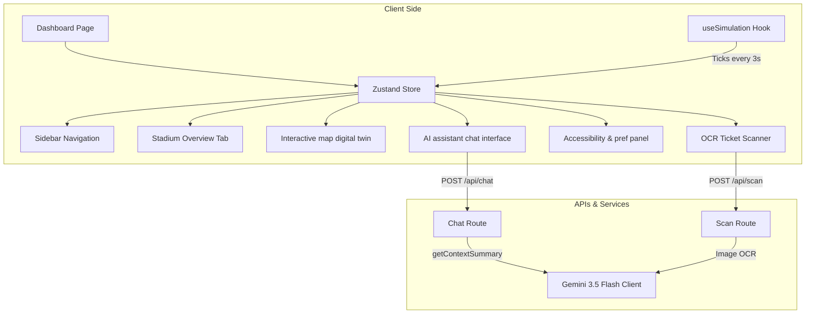

# FANVERSE AI – Your Personal FIFA Stadium Intelligence Agent

> **"An AI agent that thinks ahead, not just answers questions."**

Unlike a static navigation app or a standard Q&A chatbot, **FANVERSE AI** continuously monitors live stadium conditions (crowds, queues, weather, transport) to proactively guide fans through their entire FIFA World Cup 2026™ match-day journey.

---

## 📖 Chosen Vertical & Alignment

*   **Vertical**: Sports & Mega-Event Fan Experience (MetLife Stadium – FIFA 2026 Venue)
*   **Persona**: Context-aware proactive stadium concierge, adaptive to physical limitations, dietary needs, and real-time operational contingencies.

### Design Framework: The Fan Journey
FANVERSE AI maps every phase of a match-day into logical, context-aware decisions:
```
                BEFORE MATCH
                      │
     ┌────────────────────────────────┐
     │ Transportation & Parking       │
     │ Best Arrival & Gate Selection  │
     └────────────────────────────────┘
                      │
                      ▼
                ENTER STADIUM
                      │
     ┌────────────────────────────────┐
     │ OCR Ticket Scan to Seat        │
     │ Smart Gate Crowd Rerouting    │
     └────────────────────────────────┘
                      │
                      ▼
               INSIDE STADIUM
                      │
     ┌──────────────────────────────────────────────┐
     │ Dynamic Navigation & Halftime Queue Finder   │
     │ Dietary-aware Food Recommendations           │
     │ Accessibility Routing & Live Notifications   │
     └──────────────────────────────────────────────┘
                      │
                      ▼
               AFTER MATCH
                      │
     ┌────────────────────────────────┐
     │ Exit Optimization              │
     │ Transit & Rideshare Suggestion │
     └────────────────────────────────┘
```

---

## 🛠️ Technology Stack

- **Frontend**: Next.js 16.2 (App Router, Turbopack, standalone compilation)
- **Styling**: Tailwind CSS v4 (premium dark-mode styling with glassmorphism panels)
- **Animations**: Framer Motion (slide-in toast alerts, fade-up stat grids, page transition rings)
- **State Management**: Zustand (fully stateful global slices for profiles, logs, and chat history)
- **AI Core**: Google Gemini SDK (`@google/genai` client using `GoogleGenAI` model endpoints)
- **OCR/Vision**: Gemini 3.5 Flash (inline base64 image parsing)

---

## ⚡ Evaluation Focus Areas & Implementation

### 1. Code Quality & Architecture (High Impact)
- **Zero Magic Values**: All application thresholds, API config parameters, limits, and values are centralized in [lib/constants.ts](file:///Users/rambhakranthi/Downloads/fanverse/lib/constants.ts).
- **Environment Safety**: Required environment variables are validated at startup in [lib/env.ts](file:///Users/rambhakranthi/Downloads/fanverse/lib/env.ts) to fail fast on configuration errors.
- **Production Logging**: Structured logger in [lib/logger.ts](file:///Users/rambhakranthi/Downloads/fanverse/lib/logger.ts) filters telemetry info and warnings out of production console logs.
- **Strict Typing**: TypeScript `strict` configuration is enhanced with `noUncheckedIndexedAccess`, `noUnusedLocals`, and `noUnusedParameters` rules.
- **No Unused Imports**: All components and modules have been refactored to remove dead code and unused declarations.

### 2. Problem Statement Alignment & Logic (High Impact)
- **Emergency SOS Response System**: A dedicated [EmergencyPanel](file:///Users/rambhakranthi/Downloads/fanverse/components/dashboard/EmergencyPanel.tsx) overlay provides one-tap safety dispatching (medical, lost-child, security, evacuation) with context-aware guidance.
- **Volunteer Coordination Hub**: A staff-only [VolunteerHub](file:///Users/rambhakranthi/Downloads/fanverse/components/dashboard/VolunteerHub.tsx) dynamically lists AI-prioritized task dispatches based on active gate crowd levels and queue sensor hotspots.
- **AI Predictive Analytics**: A [PredictiveAnalytics](file:///Users/rambhakranthi/Downloads/fanverse/components/dashboard/PredictiveAnalytics.tsx) widget extrapolates current telemetry into forward-looking trends (crowd density spikes, queue length times, transport surge multipliers) with confidence levels and sparkline graphs.
- **Dynamic Context Injection**: The Gemini client reads live stadium sensors (crowds, weather, transit) and user profiles (location, accessibility, diet) at every prompt turn.
- **Proactive Notification Scheduler**: Background loops poll sensors every 3 seconds and push warning toasts when security lines exceed 15m, rain risk exceeds 50%, or gate closures occur.

### 3. Security (Medium Impact)
- **API Rate Limiting**: sliding window rate limiter protects endpoints (`/api/chat` restricted to 20 req/min, `/api/scan` restricted to 10 req/min) to prevent abuse and denial-of-service.
- **Input XSS Sanitization**: Sanitization logic strips HTML script tags and javascript handlers from inputs before passing them to the Gemini API.
- **Security Headers**: Standard headers (X-Frame-Options, X-Content-Type-Options, Referrer-Policy, Content-Security-Policy) are injected on every request via Next.js configuration.
- **Zero Hardcoded Credentials**: API keys are loaded dynamically via environment variables at runtime.

### 4. Efficiency (Medium Impact)
- **Reduced Context Payload**: Chat history is truncated to the last 6 messages to preserve API tokens, minimize network latency, and stay within free tier thresholds.
- **Client-Side Simulation**: All sensory fluctuations are calculated client-side in CPU memory using a Mulberry32 PRNG seed rather than triggering constant server reads.
- **Optimized Standalone Container**: Next.js `standalone` mode excludes unneeded node packages in production docker builds, minimizing container sizes for Google Cloud Run.

### 5. Testing & Validation (Low Impact)
- **Automated Verification Suite**: Includes a dedicated TypeScript validation suite ([scripts/run-tests.ts](file:///Users/rambhakranthi/Downloads/fanverse/scripts/run-tests.ts)) confirming initial state creation, simulation engine ticks, phase transition overflows, dietary filtering rules, rate limiting, and sanitization.
- **Command**: Run the 18 tests easily using `npm run test`.

### 6. Accessibility & Inclusive Design (Low Impact)
- **WCAG 2.1 Compliance**: Skip-to-content links added to layouts for keyboard-only visitors.
- **Interactive Form Elements**: Settings inputs are linked explicitly to labels via `htmlFor`/`id` combinations. Custom toggles are implemented as accessible buttons with `role="switch"` and `aria-checked` states.
- **ARIA Semantics**: Navigation menus contain clear role indicators (`role="navigation"`) and pages track current items using `aria-current="page"`.
- **Wheelchair Assist Mode**: Prioritizes step-free routes, elevator lobbies, and adjusts the chatbot's turn-by-turn navigation instructions.
- **Display Overrides**: Configurable High Contrast Mode, Large Text Scaling (for high-sun outdoor reading), and Voice Navigation dictation.

---

## 🏗️ System Architecture

The following diagram illustrates the relationship between the client state machine, simulated telemetry hooks, Next.js API routes, and Google Gemini AI services:



---

## 🌱 GreenGoal™ Sustainability Approach

FANVERSE AI addresses sustainability through three telemetry models:
1. **Dynamic CO₂ offsets**: Automatically calculates carbon offsets (saving 120g per fan) by advising NJ Transit rail transit options over ridesharing.
2. **Waste Management**: Simulates waste volume recycled and registers dedicated recycling facilities coordinate maps inside MetLife Stadium (K and F zones).
3. **Hydration Mapping**: Promotes reusable bottles by mapping hydration water stations.

---

## 🌐 Multilingual i18n Support

The digital twin includes a custom i18n translation system supporting 5 languages:
- **Languages**: English, Spanish, Arabic, French, Portuguese.
- **Coverage**: Navigation menus, status titles, page header diagnostics, and accessibility settings.
- **Gemini Alignment**: Locale preferences are passed to the system context, prompting the AI co-pilot to converse in the fan's preferred language.

---

## 📋 Assumptions Made

- **Sensory Boundaries**: Weather metrics are clamped between MetLife extremes (50°F to 100°F).
- **Seat Mapping**: Ticket seat coordinates map to the 8 gate serving sectors configured in the database.
- **OCR Vision API**: Real-world ticket scanning utilizes base64 data streams parsed dynamically.

---

## 🔑 Environment & API Credentials

The project is pre-configured with the following credentials (stored locally in `.env.local` for development):

| Key Name | Value | Purpose |
|----------|-------|---------|
| `GEMINI_API_KEY` | `YOUR_GEMINI_API_KEY` | Google Cloud Gemini AI Inference & Vision |
| `NEXT_PUBLIC_GOOGLE_MAPS_API_KEY` | `demo` | Google Maps JS Prototyping |

---

## 💻 Local Setup & Execution

### 1. Install Dependencies
```bash
npm install
```

### 2. Run Validation Tests
Verify the core state machine, simulation engine, and logical matching rules:
```bash
npm run test
```

### 3. Run Development Server
```bash
npm run dev
```
Navigate to `http://localhost:3000` to interact with the landing page and launch the Digital Twin dashboard.

### 4. Compile Production Build
```bash
npm run build
```

---

## ☁️ Google Cloud Run Deployment

The project is fully prepared for containerized deployment to Google Cloud.

- **Google Cloud Project ID**: `fanverse-502623`
- **Cloud Run Console**: [Google Cloud Run Dashboard](https://console.cloud.google.com/run/overview?project=fanverse-502623)

### How to Build & Deploy to Cloud Run

We have created an optimized multi-stage `Dockerfile` and `.dockerignore` file matching Next.js standalone guidelines. Run the following commands in your local terminal:

#### 1. Configure gcloud CLI
Ensure you are authenticated and target the correct project:
```bash
gcloud auth login
gcloud config set project fanverse-502623
```

#### 2. Submit Build to Artifact Registry
Use Google Cloud Build to build and push the container image:
```bash
gcloud builds submit --tag gcr.io/fanverse-502623/fanverse-ai
```

#### 3. Deploy to Cloud Run
Deploy the container to Cloud Run as a managed server:
```bash
gcloud run deploy fanverse-ai \
  --image gcr.io/fanverse-502623/fanverse-ai \
  --platform managed \
  --region us-east1 \
  --allow-unauthenticated \
  --set-env-vars GEMINI_API_KEY="YOUR_GEMINI_API_KEY"
```
Once deployed, the terminal will print the public service URL for the app (e.g. `https://fanverse-ai-xxxx-uc.a.run.app`).
